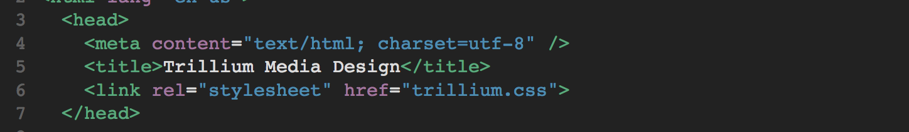
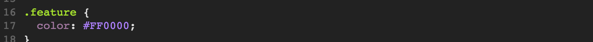
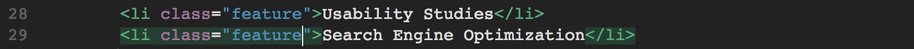

# Web Creators Day 2 Warmup Activity

## Mini Challenge 

See if you can update your Trillium home page to look like the picture below: 

We are now going to use CSS (Cascading Style Sheets) to make our webpage more appealing. 

1. Rename `style.css` to `trillium.css` and delete all the text inside it. 

2. Add a link to your new `trillium.css` in your HTML files. This allows your HTML to "see" the CSS and apply the changes. 

3. Add these styles to your into your trillium.css file:

Your webpage should look like this now:

## Classes and IDs

### Configure the CSS

4. Create a class name `feature` that configures red (#FF0000) text. Add the following code **TO THE BOTTOM** of your `trillium.css` file:

Classes are used to configure multiple html elements 

5. Create an id named `content` that configures an off-white background color. Add the following code **TO THE BOTTOM** of your `trillium.css` file:

IDs are used to configure a **SINGLE** html element

### Configure the HTML

6. Modify the last two `<li>` tags in the unordered list. Add a class attribute that associates the `<li>` with the `feature` class. 

7. Modify the opening div tag (located below the closing nav tag). Add an id attribute that associates the div with the id named `content`:

### Span 

