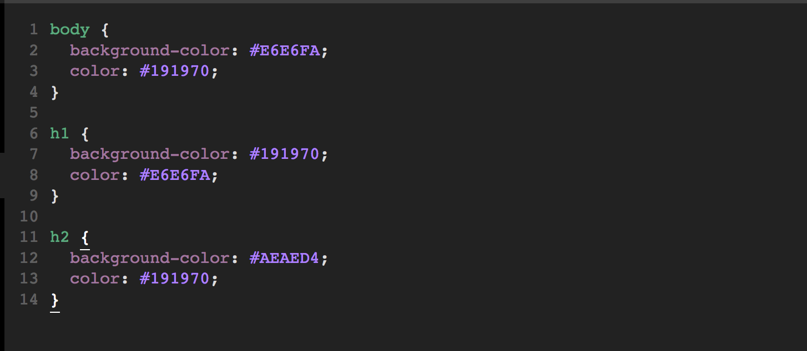
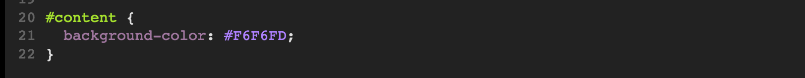
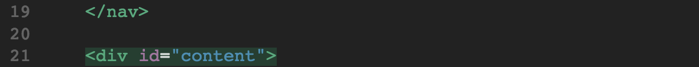
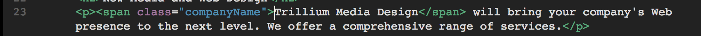

# Web Creators Day 2 Warmup Activity

## Mini Challenge 

See if you can update your Trillium home page to look like the picture below: 

We are now going to use CSS (Cascading Style Sheets) to make our webpage more appealing. 

1. Rename `style.css` to `trillium.css` and delete all the text inside it. 

2. Add a link to your new `trillium.css` in your HTML files. This allows your HTML to "see" the CSS and apply the changes. 

3. Add these styles to your into your trillium.css file:

Your webpage should look like this now:

## Classes and IDs

### Configure the CSS

4. Create a class name `feature` that configures red (#FF0000) text. Add the following code **TO THE BOTTOM** of your `trillium.css` file:

Classes are used to configure multiple html elements 

5. Create an id named `content` that configures an off-white background color. Add the following code **TO THE BOTTOM** of your `trillium.css` file:

IDs are used to configure a **SINGLE** html element

### Configure the HTML

6. Modify the last two `<li>` tags in the unordered list. Add a class attribute that associates the `<li>` with the `feature` class. 

7. Modify the opening div tag (located below the closing nav tag). Add an id attribute that associates the div with the id named `content`:

### Span 

8. Create a class name `companyName` that will configure the color of our company name in our paragraph. Remember to put it at the bottom of your CSS file. 

9. Now modify our paragraph so that our company name is now associated with it's class. 

### One Last Tweak 
I don't like the space between the header and the nav bar. Let's adjust the margin so that they're closer. Modify the h1 selector in your CSS file to look like this:

Your page should now look like this:

